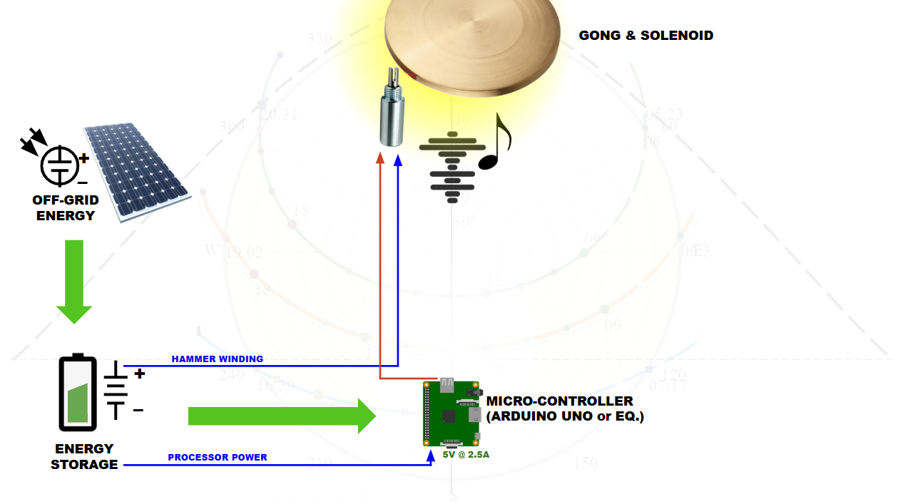

# :sunny: Solar Gong Solenoid Valve -- Light-Activated Valve Controller


An ESP32-based solar-powered controller that uses a **VEML7700 ambient light sensor** to automatically activate a solenoid valve once per day when sunlight exceeds a calibrated threshold. Designed for outdoor/remote deployment with battery-powered operation and field-calibratable light sensitivity.

*Freelance project -- designed and delivered as a complete embedded solution.*

---

## :camera: Hardware

### Device Assembly


### Installation
.png)

---

## :zap: Key Highlights

- **Light-triggered solenoid activation** -- VEML7700 sensor detects sunlight above calibrated threshold
- **Once-per-day firing** -- Valve activates once per 20-hour cycle, then locks until next cycle
- **Field calibration** -- Long-press button to save current ambient light as threshold (stored in NVS flash)
- **Manual override** -- Short-press button to toggle valve open/closed at any time
- **Solar/battery operation** -- Designed for outdoor deployment without mains power
- **RTC memory persistence** -- State survives deep-sleep cycles

---

## :wrench: Features

### Automatic Light-Based Triggering
- **VEML7700 I2C ambient light sensor** -- High-accuracy lux measurement with averaged readings (5 samples)
- Sensor configured: Gain 1/8, Integration time 100ms
- Checks light level every **10 seconds**
- Activates relay for **2 seconds** when lux exceeds threshold
- Locks out further activations until next 20-hour day cycle resets

### Field Calibration Mode
1. **Long press** button (3 seconds) to enter calibration
2. LED blinks slowly to indicate calibration mode
3. **Short press** to capture current ambient light level (averaged over 10 samples)
4. Threshold saved to **NVS flash** (persists across power cycles)
5. Three quick LED blinks confirm successful calibration

### Manual Override
- **Short press** button to toggle relay ON/OFF manually
- LED indicates current manual state
- Overrides automatic control until toggled back

### Hardware Configuration
| Pin | Function |
|-----|----------|
| GPIO 19 | Relay control (active-low) |
| GPIO 4 | Button input (internal pull-up) |
| GPIO 5 | Status LED |
| I2C | VEML7700 light sensor |

---

## :file_folder: Project Structure

```
Solar-Gong-Solenoid-Valve/
|-- Firmware/
|   +-- Solar_Gong_Firmware/       # PlatformIO ESP32 project
|       |-- src/main.cpp           # Main firmware logic
|       |-- platformio.ini         # Build configuration
|       +-- lib/                   # External libraries
|-- User Manual.pdf                # End-user documentation
|-- Component_List.pdf             # Bill of materials
|-- Project_Plan.pdf               # Project planning document
|-- Additional_Information.pdf     # Supplementary technical info
|-- image.png                      # Device photo
+-- image (1).png                  # Installation photo
```

---

## :hammer_and_wrench: Tech Stack

| Component | Technology |
|-----------|-----------|
| **MCU** | ESP32 (Espressif Systems) |
| **Language** | C/C++ (PlatformIO / Arduino) |
| **Light Sensor** | VEML7700 (Vishay) -- I2C ambient light sensor |
| **Actuator** | Solenoid valve via relay module |
| **Storage** | NVS (Non-Volatile Storage) for threshold persistence |
| **Memory** | RTC memory for deep-sleep state retention |
| **Power** | Solar panel + battery |
| **Build System** | PlatformIO |

---

## :gear: Firmware Parameters

| Parameter | Value | Description |
|-----------|-------|-------------|
| `DEFAULT_LIGHT_THRESHOLD_LUX` | 100.0 | Default activation threshold (lux) |
| `VALVE_OPEN_TIME_MS` | 2000 | Relay activation duration (ms) |
| `DAY_CYCLE_MS` | 72,000,000 | 20-hour day cycle (ms) |
| `SENSOR_CHECK_INTERVAL_MS` | 10,000 | Light sensor polling interval (ms) |
| `LONG_PRESS_DURATION_MS` | 3000 | Button hold time for calibration (ms) |
| `SHORT_PRESS_MAX_MS` | 500 | Max button press time for toggle (ms) |

---

## :bust_in_silhouette: Author

**Muhammad Zaeem Sarfraz** -- Electronics & IoT Hardware Engineer

- :link: [LinkedIn](https://www.linkedin.com/in/zaeemsarfraz7744/)
- :email: Zaeem.7744@gmail.com
- :earth_africa: Vaasa, Finland
